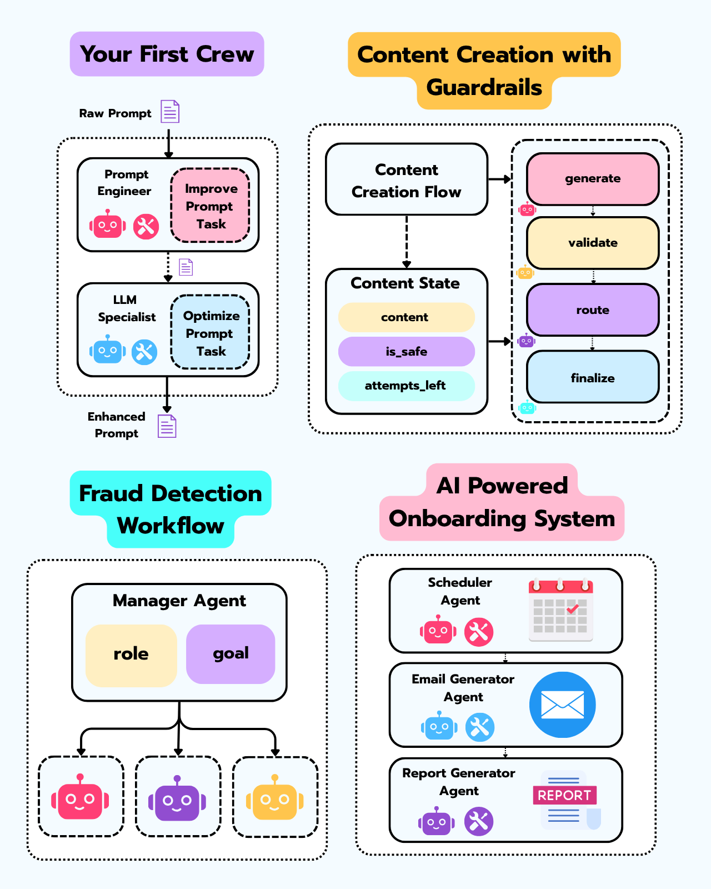

# CrewAI Workshops Collection

  
   
  <em>Image created by Miguel Otero Pedrido from <a href="https://theneuralmaze.substack.com/">The Neural Maze</a></em>

This repository is a collection of CrewAI workshops, where the latest workshop is in the main branch (and published via GitHub Pages), while older workshops are maintained as separate branches.

## Workshop: Agentic AI with CrewAI

The main branch contains the materials and assignments for the **Agentic AI: Build a Multi-Agent Application with CrewAI** workshop. This comprehensive workshop teaches participants how to build multi-agent applications using the CrewAI framework. The workshop website serves as a central hub to guide participants through the hands-on learning session.

## Overview

A hands-on Python workshop featuring:
- Practical assignments and exercises
- Step-by-step guides
- Learning resources and documentation
- Multi-agent orchestration with CrewAI

## Structure

1. **Assignments**: Practical exercises covering agent creation, orchestration, and real-world applications
2. **Guides**: Instructions and explanations for each assignment
3. **Resources**: Additional learning materials and presentation slides
4. **Website**: Interactive workshop platform (published via GitHub Pages)

## Previous Workshops

Older workshop versions are maintained as separate branches in this repository, allowing participants to access historical materials and track the evolution of the workshop content. To access the webpage for any workshop, simply clone the repository and open the `index.html` file in your browser.

- **Porto Tech Hub 2025**: `porto-tech-hub-2025` branch - Agentic AI workshop materials for Porto Tech Hub 2025
- **Data Hack Summit 2025**: `data-hack-summit-2025` branch - Agentic AI workshop materials for Data Hack Summit 2025
- **PyCon DE 2025**: `pycon-de-2025` branch - Agentic AI workshop for PyCon DE & PyData 2025

## License

This project is licensed under the MIT License - see the [LICENSE](LICENSE) file for details.
